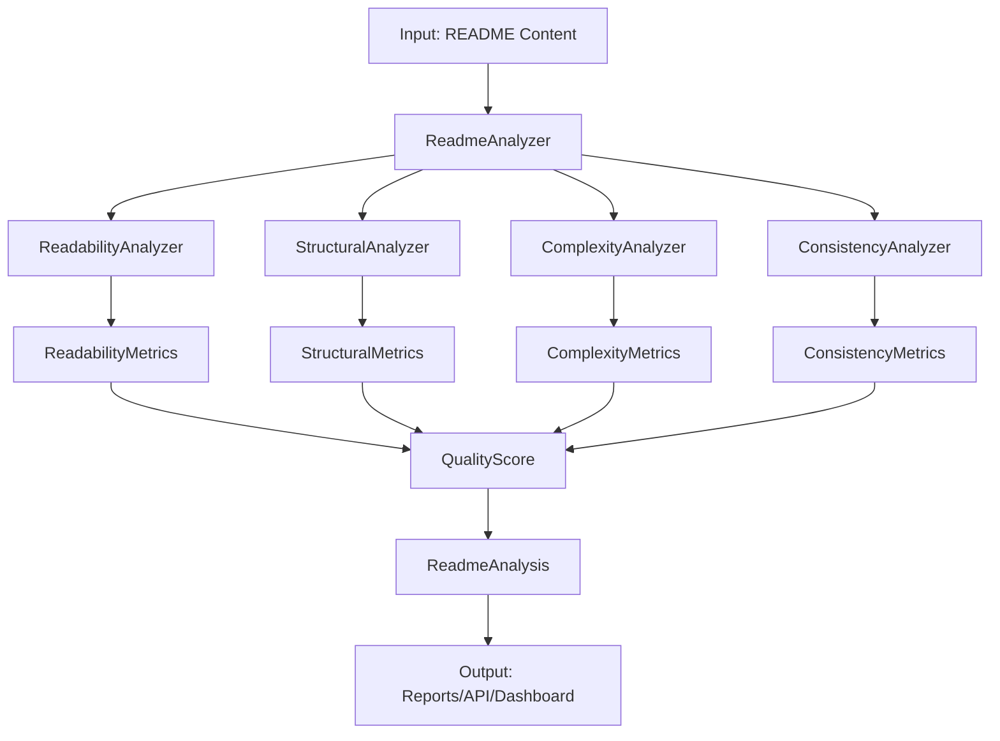

# 📊 README Quality Platform

> **Comprehensive Multi-Dimensional README Quality Assessment Toolkit**

[](https://readme-quality-platform.dev)
[](https://python.org)
[](LICENSE)
[](https://api.readme-quality-platform.dev)
[](github_actions/)

A comprehensive platform for analyzing README file quality across multiple analytical dimensions, providing actionable insights and recommendations for documentation improvement. Implements established readability formulas, structural assessment algorithms, and code-documentation consistency analysis.

## 🌟 Key Features

### 📖 **Multi-Dimensional Analysis**
- **Readability Metrics**: Flesch Reading Ease, Flesch-Kincaid Grade Level, Gunning Fog Index, SMOG Index, Dale-Chall Score, Automated Readability Index
- **Structural Integrity**: Section completeness, hierarchical organization, documentation patterns
- **Complexity Assessment**: Markdown sophistication, formatting richness, element diversity
- **Code Consistency**: Repository-README alignment, API documentation coverage, class/method documentation

### 🛠 **Multiple Interfaces**
- **CLI Tool**: Rich terminal interface with batch processing capabilities
- **REST API**: Comprehensive API endpoints for integration
- **Web Dashboard**: Interactive visual interface with real-time analysis
- **GitHub Actions**: Automated quality checks in CI/CD pipelines

### 🔗 **Integrations**
- **GitHub API**: Direct repository analysis and metadata extraction
- **Multiple Languages**: Python, JavaScript, Java, Go, Rust, C#, and more
- **Export Formats**: JSON, Markdown, CSV, PDF reports
- **Webhook Support**: Real-time notifications and updates

## 🚀 Quick Start

### Installation

```bash
# Install via pip
pip install readme-quality-platform

# Or install from source
git clone https://github.com/readme-quality-platform/readme-quality-platform.git
cd readme-quality-platform
pip install -e .
```

### Basic Usage

```python
from readme_quality_platform import ReadmeAnalyzer

# Initialize analyzer
analyzer = ReadmeAnalyzer()

# Analyze local file
analysis = analyzer.analyze_file("README.md")
print(f"Overall Score: {analysis.quality.overall_score:.1f}/100")

# Analyze content directly
analysis = analyzer.analyze_content(readme_content)

# Get analysis summary
summary = analyzer.get_analysis_summary(analysis)
print(summary)
```

### CLI Usage

```bash
# Analyze single README
readme-analyzer README.md

# Analyze GitHub repository
readme-analyzer https://github.com/user/repo

# Batch analysis
readme-analyzer batch --input targets.txt --output results/

# Custom weights and formatting
readme-analyzer README.md --weights 0.3,0.3,0.2,0.2 --format json
```

### API Usage

```bash
# Start API server
readme-server

# Analyze via REST API
curl -X POST "http://localhost:8000/analyze/content" \
  -H "Content-Type: application/json" \
  -d '{"content": "# My Project\n\nThis is a sample README..."}'
```

## 📊 Analysis Dimensions

### 1. Readability Analysis (25% default weight)

Implements established linguistic formulas adapted for technical documentation:

| Metric | Description | Range |
|--------|-------------|-------|
| **Flesch Reading Ease** | 0-100 scale, higher = more readable | 0-100 |
| **Flesch-Kincaid Grade** | U.S. education grade level required | 1-20+ |
| **Gunning Fog Index** | Years of formal education needed | 6-20+ |
| **SMOG Index** | Grade level based on polysyllable count | 6-18+ |
| **Dale-Chall Score** | Difficult word ratio analysis | 4-10+ |
| **ARI** | Character-based readability formula | 1-20+ |

### 2. Structural Integrity (30% default weight)

Evaluates organization and completeness according to documentation best practices:

- ✅ **Essential Sections**: Title, Description, Installation, Usage, Examples
- 🎯 **Bonus Sections**: API Docs, Contributing, License, Changelog, Badges
- 📋 **Organization**: Heading hierarchy, table of contents, section flow
- 🏗️ **Quality Indicators**: Content depth, section completeness, logical structure

### 3. Complexity Assessment (20% default weight)

Quantifies documentation sophistication and richness:

| Element Type | Weight | Description |
|--------------|--------|-------------|
| **Code Blocks** | 5 | Examples and demonstrations |
| **Images/Diagrams** | 3 | Visual documentation elements |
| **Tables** | 4 | Structured information presentation |
| **Links** | 2 | External references and resources |
| **Lists** | 1 | Organized information |
| **Formatting** | 1 | Bold, italic, emphasis |

### 4. Code Consistency (25% default weight)

Analyzes alignment between repository codebase and README documentation:

- 🔍 **Code Element Extraction**: Classes, functions, methods, API endpoints
- 📝 **Documentation Coverage**: Percentage of code elements mentioned
- 🔗 **API Alignment**: Endpoint documentation completeness
- ⚖️ **Consistency Scoring**: Correlation between code and docs

## 🎯 Scoring System

### Overall Quality Score Calculation

```
Overall Score = (Readability × 0.25) + (Structure × 0.30) + (Complexity × 0.20) + (Consistency × 0.25)
```

### Grade Levels

| Score Range | Grade | Quality Level |
|-------------|-------|---------------|
| 90-100 | A+ | Excellent |
| 85-89 | A | Very Good |
| 80-84 | A- | Good |
| 75-79 | B+ | Above Average |
| 70-74 | B | Average |
| 60-69 | C | Below Average |
| < 60 | D-F | Poor |

## 🔧 Configuration

### Custom Weights

```python
from readme_quality_platform import Config

config = Config()
config.analysis.scoring_weights = {
    'readability': 0.20,
    'structural': 0.40,  # Emphasize structure
    'complexity': 0.15,
    'consistency': 0.25,
}

analyzer = ReadmeAnalyzer(config.get_analyzer_config())
```

### YAML Configuration

```yaml
# config.yaml
analysis:
  scoring_weights:
    readability: 0.25
    structural: 0.30
    complexity: 0.20
    consistency: 0.25
  
  quality_thresholds:
    excellent: 90
    good: 75
    fair: 60
    poor: 45

server:
  host: "0.0.0.0"
  port: 8000
  github_token: "${GITHUB_TOKEN}"
```

## 🌐 Web Dashboard

Launch the interactive web dashboard:

```bash
readme-dashboard
```

Features:
- 📊 **Real-time Analysis**: Upload files or paste content
- 📈 **Interactive Charts**: Plotly-powered visualizations
- 🔄 **Batch Processing**: Multiple repository analysis
- 📋 **Detailed Reports**: Exportable analysis results
- ⚙️ **Custom Configuration**: Adjustable weights and thresholds

## 🤖 GitHub Actions Integration

### Basic Workflow

```yaml
# .github/workflows/readme-quality.yml
name: README Quality Check

on:
  pull_request:
    paths: ['README.md']

jobs:
  readme-quality:
    runs-on: ubuntu-latest
    steps:
      - uses: actions/checkout@v4
      - uses: readme-quality-platform/action@v1
        with:
          readme-path: 'README.md'
          fail-threshold: '70'
          comment-on-pr: 'true'
```

### Advanced Configuration

```yaml
- uses: readme-quality-platform/action@v1
  with:
    readme-path: 'docs/README.md'
    repository-path: '.'
    fail-threshold: '80'
    custom-weights: '{"readability": 0.2, "structural": 0.4, "complexity": 0.15, "consistency": 0.25}'
    output-format: 'markdown'
    include-code-analysis: 'true'
    comment-on-pr: 'true'
    github-token: ${{ secrets.GITHUB_TOKEN }}
```

## 📚 API Reference

### REST Endpoints

| Method | Endpoint | Description |
|--------|----------|-------------|
| `POST` | `/analyze/content` | Analyze README content |
| `POST` | `/analyze/file` | Upload and analyze file |
| `POST` | `/analyze/repository` | Analyze GitHub repository |
| `POST` | `/analyze/batch` | Batch analysis |
| `GET` | `/health` | Health check |
| `GET` | `/config` | Current configuration |

### Example API Response

```json
{
  "success": true,
  "analysis": {
    "metadata": {
      "repository_url": "https://github.com/user/repo",
      "analysis_timestamp": "2024-01-15T10:30:00Z",
      "file_size_bytes": 5420
    },
    "quality": {
      "overall_score": 87.5,
      "grade_level": "A-",
      "readability_score": 82.3,
      "structural_score": 91.2,
      "complexity_score": 85.7,
      "consistency_score": 89.1
    },
    "readability": {
      "flesch_reading_ease": 67.8,
      "flesch_kincaid_grade": 9.2,
      "word_count": 1247,
      "readability_consensus": "fairly easy"
    },
    "recommendations": [
      "Add API endpoint documentation with examples",
      "Include more code examples in usage section",
      "Consider adding troubleshooting section"
    ]
  },
  "processing_time_ms": 1247
}
```

## 🧪 Testing

### Running Tests

```bash
# Run all tests
python -m pytest

# Run specific test categories
python -m pytest tests/test_readability.py
python -m pytest tests/test_structural.py
python -m pytest tests/test_api.py

# Run with coverage
python -m pytest --cov=readme_quality_platform --cov-report=html
```

### Test Categories

- **Unit Tests**: Individual component functionality
- **Integration Tests**: Cross-component interactions
- **API Tests**: REST endpoint validation
- **CLI Tests**: Command-line interface testing
- **Performance Tests**: Large file and batch processing
- **Edge Cases**: Error handling and boundary conditions

## 🏗️ Architecture

### Core Components

```
├── core/
│   ├── models.py          # Data models and schemas
│   ├── analyzer.py        # Main analysis orchestrator
│   └── config.py          # Configuration management
├── metrics/
│   ├── readability.py     # Readability formulas
│   ├── structural.py      # Structure analysis
│   ├── complexity.py      # Sophistication assessment
│   └── consistency.py     # Code-doc alignment
├── analyzers/
│   ├── github.py          # GitHub integration
│   ├── directory.py       # Local directory analysis
│   └── web.py             # Web content analysis
├── api/
│   └── server.py          # FastAPI REST server
├── web/
│   └── app.py             # Web dashboard
├── cli/
│   └── main.py            # Command-line interface
└── github_actions/
    ├── action.yml         # GitHub Action definition
    └── entrypoint.sh      # Action implementation
```

### Data Flow



## 🤝 Contributing

We welcome contributions! Please see our [Contributing Guide](CONTRIBUTING.md) for details.

### Development Setup

```bash
# Clone repository
git clone https://github.com/readme-quality-platform/readme-quality-platform.git
cd readme-quality-platform

# Create virtual environment
python -m venv venv
source venv/bin/activate  # or venv\Scripts\activate on Windows

# Install development dependencies
pip install -e ".[dev]"

# Install pre-commit hooks
pre-commit install

# Run tests
python -m pytest
```

### Code Quality Standards

- **Code Coverage**: Minimum 90% test coverage
- **Type Hints**: Full type annotation coverage
- **Documentation**: Comprehensive docstrings
- **Linting**: Black, flake8, mypy compliance
- **Testing**: pytest with comprehensive test suite

## 📄 License

This project is licensed under the MIT License - see the [LICENSE](LICENSE) file for details.

## 🙏 Acknowledgments

### Research & Methodologies

- **Readability Formulas**: Based on established linguistic research
  - Flesch, R. (1948). A new readability yardstick
  - Kincaid et al. (1975). Derivation of new readability formulas
  - Gunning, R. (1952). The technique of clear writing
  - McLaughlin, G.H. (1969). SMOG grading
  - Dale, E. & Chall, J.S. (1948). A formula for predicting readability

- **Documentation Patterns**: Industry best practices and conventions
- **Generate README Eval**: LLM-powered evaluation methodologies
- **readme-score**: Complexity scoring inspirations

### Dependencies

- **NLTK**: Natural language processing
- **TextStat**: Readability calculations
- **BeautifulSoup**: HTML/Markdown parsing
- **FastAPI**: REST API framework
- **Plotly**: Interactive visualizations
- **Rich**: Terminal formatting
- **PyGithub**: GitHub API integration

## 📞 Support

- **Documentation**: [https://readme-quality-platform.readthedocs.io](https://readme-quality-platform.readthedocs.io)
- **API Reference**: [https://api.readme-quality-platform.dev/docs](https://api.readme-quality-platform.dev/docs)
- **GitHub Issues**: [https://github.com/readme-quality-platform/readme-quality-platform/issues](https://github.com/readme-quality-platform/readme-quality-platform/issues)
- **Discussions**: [https://github.com/readme-quality-platform/readme-quality-platform/discussions](https://github.com/readme-quality-platform/readme-quality-platform/discussions)

## 📊 Project Stats


---

<div align="center">

**Made with ❤️ for better documentation**

[Website](https://readme-quality-platform.dev) • [Documentation](https://docs.readme-quality-platform.dev) • [API](https://api.readme-quality-platform.dev) • [GitHub](https://github.com/readme-quality-platform)

</div>